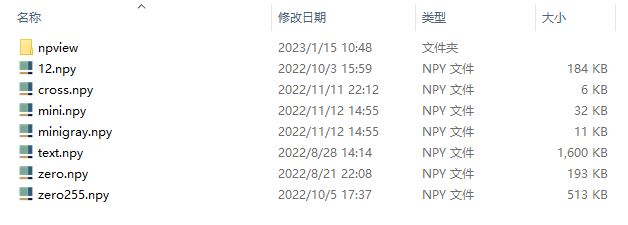
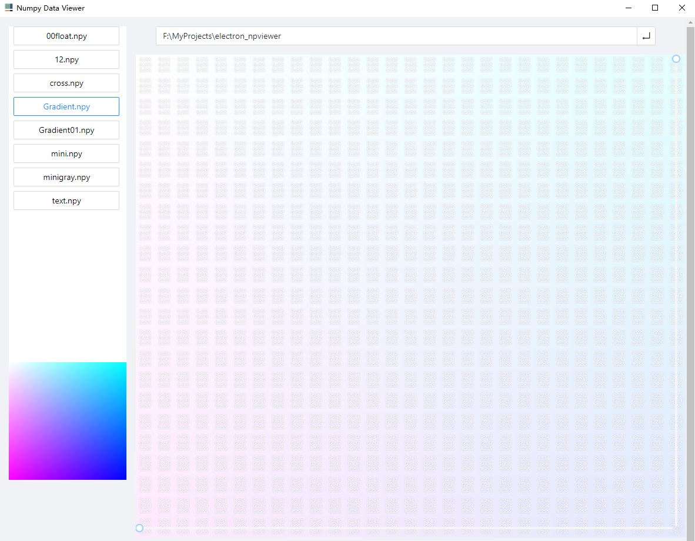

## Introduction
npviewer is an application that allows you to visualize the data in numpy's npy files in the form of heat maps. The application automatically selects the appropriate dimensions for display based on different modes.

## Features
1. Automatically selects the appropriate dimensions for display based on different modes
2. Supports visualization of different formats of numpy data, such as RGB and grayscale
3. User-friendly interface
4. Built with modern technologies such as vue3, typescript, atdv/g2plot and antdesignvue.

## Dimension Description
| Mode | Data Type | Dimension | Display | Generally Usage |
| --- | --- | --- | --- | --- |
| GRAY | uint8 | 2 | 	grayscale | Generally used for grayscale images in numpy format read by opencv |
| RGB | uint8 | 3 | RGB color image | Generally used for RGB images in numpy format read by opencv |
| HWC | other | 3 | singel channel  heat map | Generally used for 3-dimensional data, channel needs to be selected in settings |
| BCHW | other | 4 | singel channel heat map | Generally used for 4-dimensional data, supports selection of batch and channel display |
| XCHW | other | 4+ | singel channel  heat map | Generally used for data with more than 4 dimensions, supports selection of multiple channels display |

## Quick Start
download app in [release](https://github.com/rximg/npviewer/releases)  page.

There are two ways to open the NPY Viewer application:

1. By clicking on the .npy file to open it. This method will display the current matrix of focus, as well as any other matrices in the same folder.
   
2. By opening the NPY Viewer application from the desktop shortcut, and inputting the file directory or npy file to load in the address bar.
You can try using the "Gradient.npy" file in this project as a test.
   

## Development
Clone the repository: git clone https://github.com/npviewer.git
Install dependencies: npm install
Start the development server: npm run dev
Packaging
Run npm run build to package the application

## License
This project is licensed under the MIT License.

## Contact Us
We welcome any feedback and suggestions through the submission of issues. It will help us improve this project.